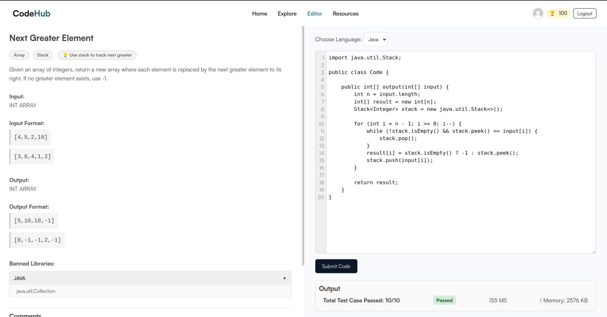

# CodeHub

CodeHub is a coding question-solving website where you can solve coding problems similar to platforms like LeetCode, Codeforces, and others. It allows users to browse coding problems, attempt solutions, and view results in an interactive, easy-to-use interface.


This project was developed as part of Project II (Semester 4) and is complete. There are no plans for further development or updates.


## Tech Stack
- **Backend:** Spring Boot (Java)
- **Frontend:** Thymeleaf, HTML, CSS, JavaScript

---

## Running the Application

### Prerequisites
Make sure you have the following installed:
- **Java 23+**
- **Gradle**
- **PostgreSQL**
- **MongoDB**
- **RedisDB**

### Set Environment Variables
Before running the application, configure the following environment variables:
```bash
MAIL_USERNAME=your_email@example.com
MAIL_PASSWORD=your_password
MONGO_URL=mongodb://localhost:27017/codehub
POSTGRESQL_URL=jdbc:postgresql://localhost:5432/codehub
POSTGRESQL_USERNAME=postgres
POSTGRESQL_PASSWORD=yourpassword
```
### Start the server
```
./gradlew bootRun
```
The application will start on http://localhost:8080
by default.
## Some images




---

